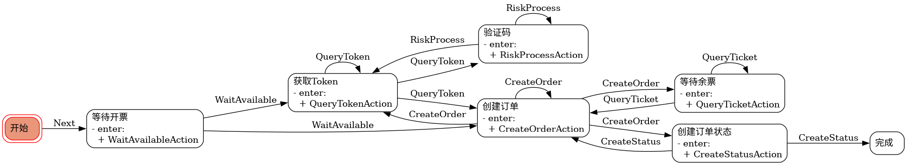

# Transition Ticket （移除配置加密版）

## 二次开发说明

本版本移除了对用户数据的加密保护，以便云上远程部署（本地机器登录，云端运行）

如无此需求请使用原版

由于移除了加密解密模块，本项目和原版的用户数据配置并不互相兼容

用户数据明文存储，建议购票成功后修改密码以便注销全平台登录状态

以下文字（包括群聊链接等）如无特殊说明均为原作者所写

使用时如遇到问题，请联系原作者，本项目不定时和原版对比更新


## 声明

[电报交流群](https://t.me/bilibili_ticket)

本程序仅供学习交流, 不得用于商业用途,

使用本程序进行违法操作产生的法律责任由操作者自行承担,

对本程序进行二次开发/分发时请注意遵守GPL-3.0开源协议,

本脚本仅适用于蹲回流票, 我们反对将其用于抢票,

黄牛/收费代抢４０００＋.

## 使用

[下载地址](https://github.com/biliticket/transition-ticket/releases)  （此链接为原版，如需打包本版请按下方说明自行操作）

注意:

1. 现仅支持部分活动, 主要是类似于BW2024这样的*实名制 一人一票 无选座*活动, 后期会增加更多类型的票务支持;
2. 如使用浏览器登录功能, 您的电脑里必须安装Chrome/Edge/Firefox浏览器, 如有安装还是提供无法启动, 则需要自行安装其中一个浏览器的Web Driver.

```bash
pip config set global.index-url https://pypi.tuna.tsinghua.edu.cn/simple
pip install poetry virtualenv pre-commit

virtualenv venv
source venv/script/activate
poetry install
python cli.py
```

## 运行流程



## 开发计划

- [ ] *Token提前刷新+自动刷新*
- [ ] 修改打包模式为目录模式, 而不是单文件模式
- [ ] 显示版本号
- [ ] 短信验证码错误修复
- [ ] Header补充
- [ ] UPX
- [ ] 多种类型活动抢票
- [ ] 图形界面(PySide6)

## 开发

- Python >=3.10,<3.13

```bash
pip config set global.index-url https://pypi.tuna.tsinghua.edu.cn/simple
pip install poetry virtualenv

virtualenv venv
source venv/script/activate
poetry install --with dev,doc,graph
pre-commit install

# 更新
poetry update
pre-commit autoupdate

# 打包
pyinstaller --clean --noconfirm --log-level WARN cli.spec
```

## 感谢

- [Amorter/biliTicker_gt](https://github.com/Amorter/biliTicker_gt)
- [Just-Prog/Bilibili_show_ticket_auto_order](https://github.com/Just-Prog/Bilibili_show_ticket_auto_order)
- [biliticket/BHYG](https://github.com/biliticket/BHYG)
- [mikumifa/biliTickerBuy](https://github.com/mikumifa/biliTickerBuy)
